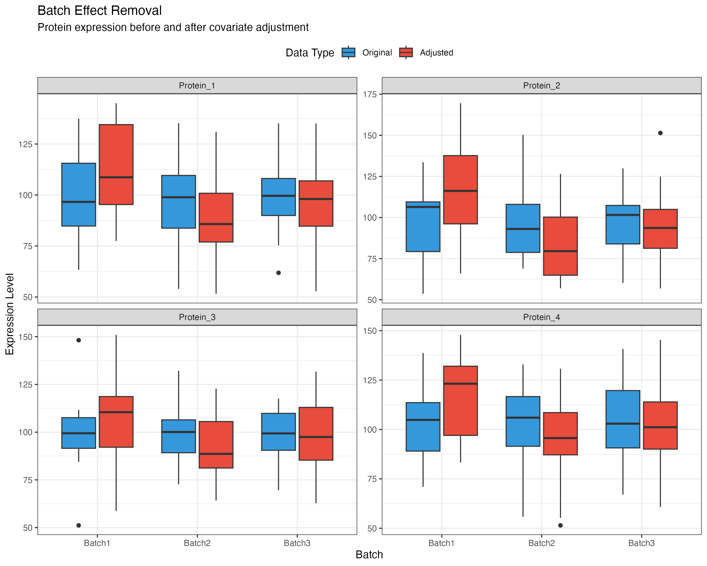
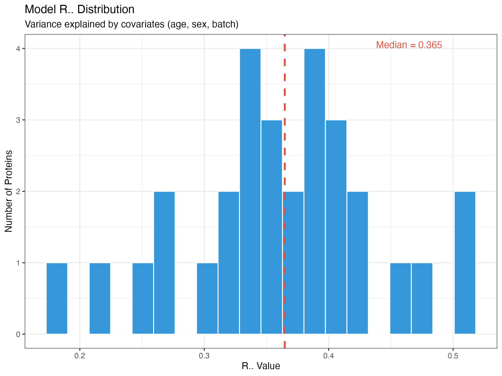
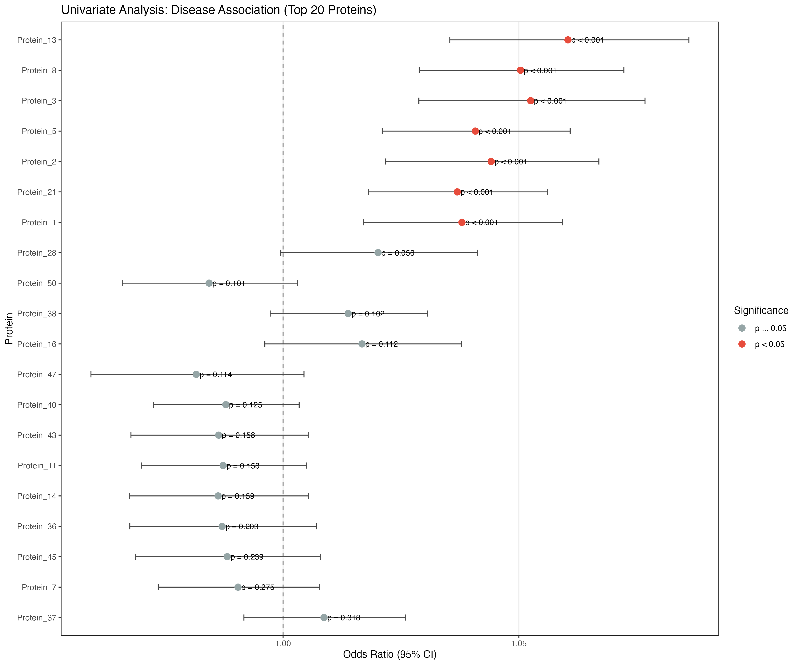
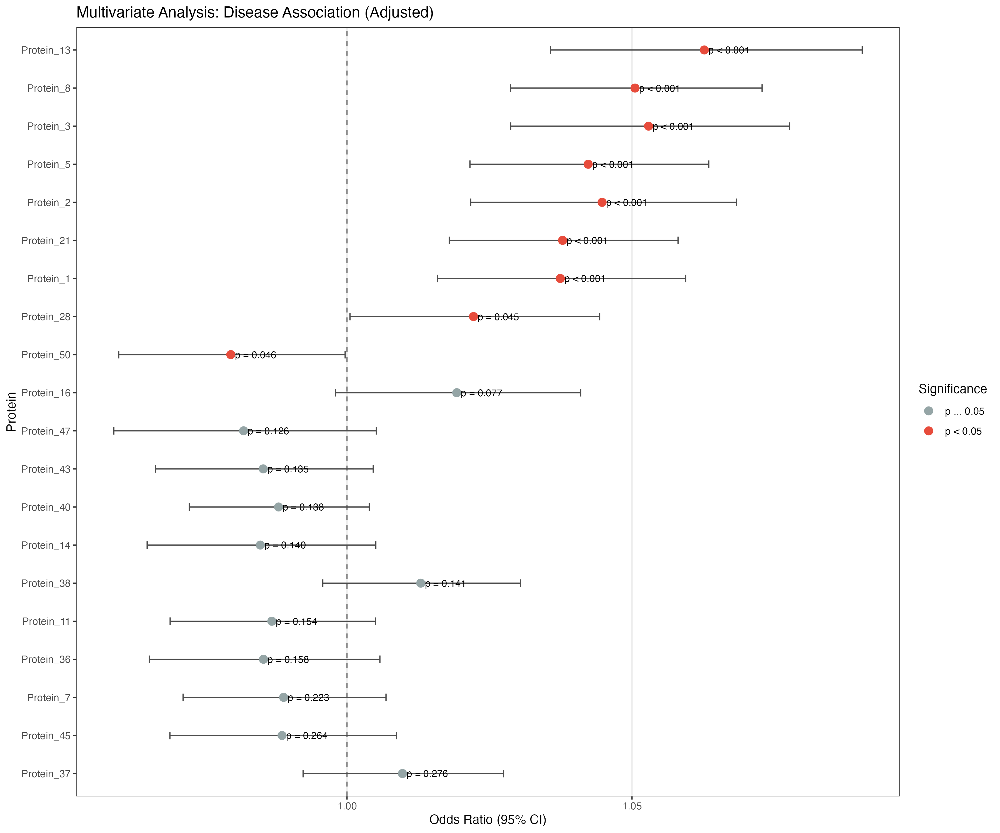
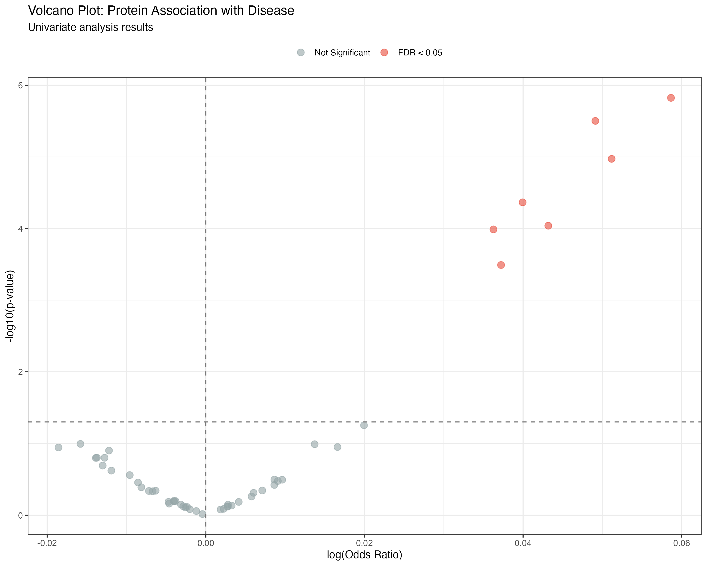
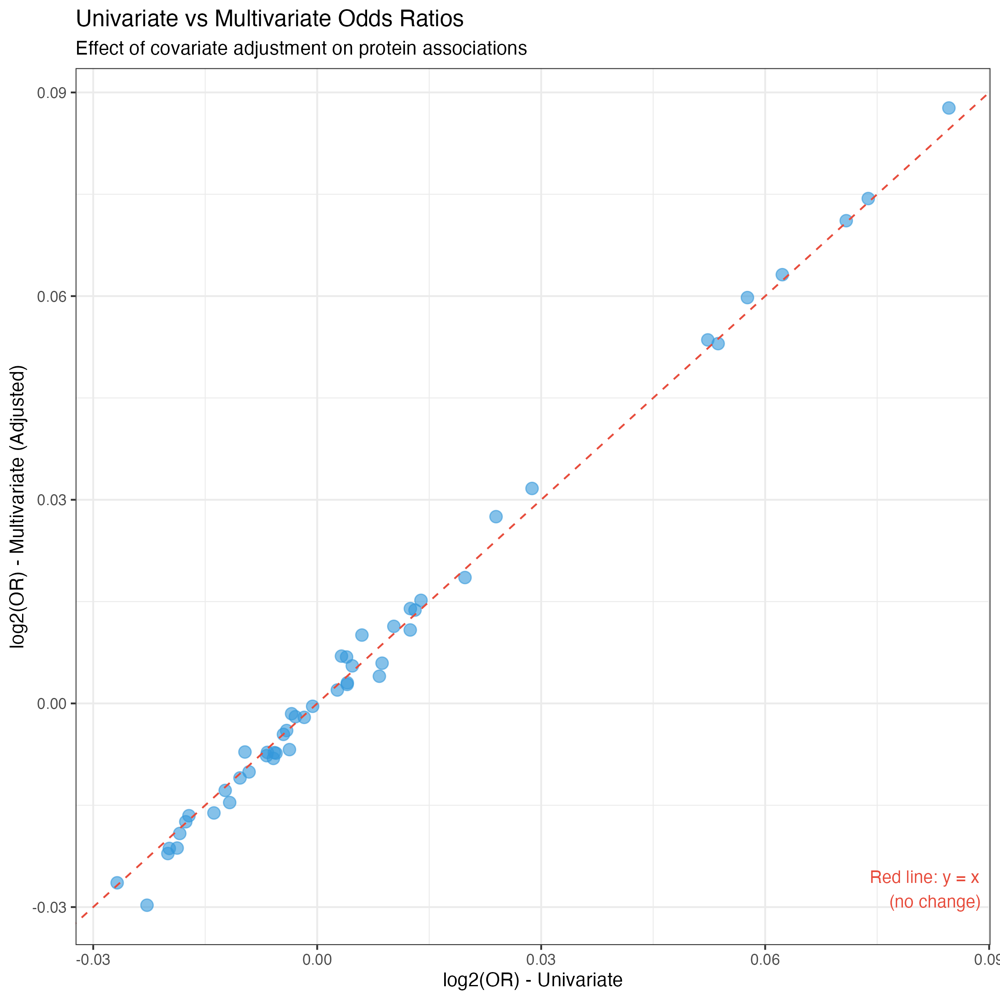
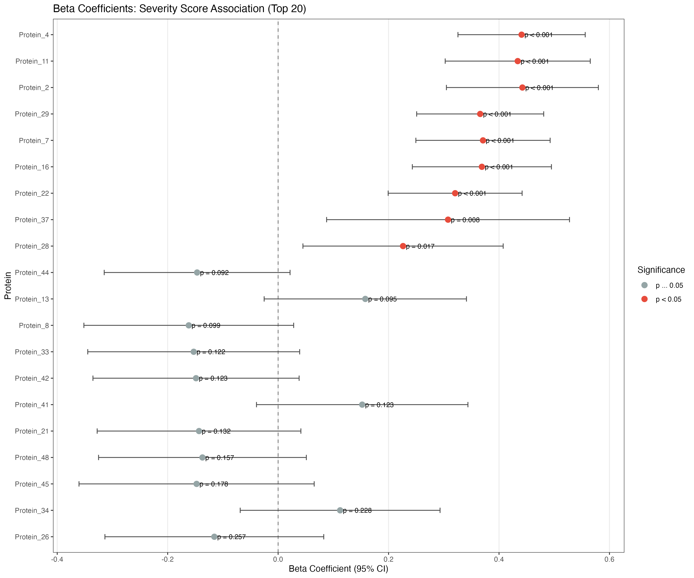
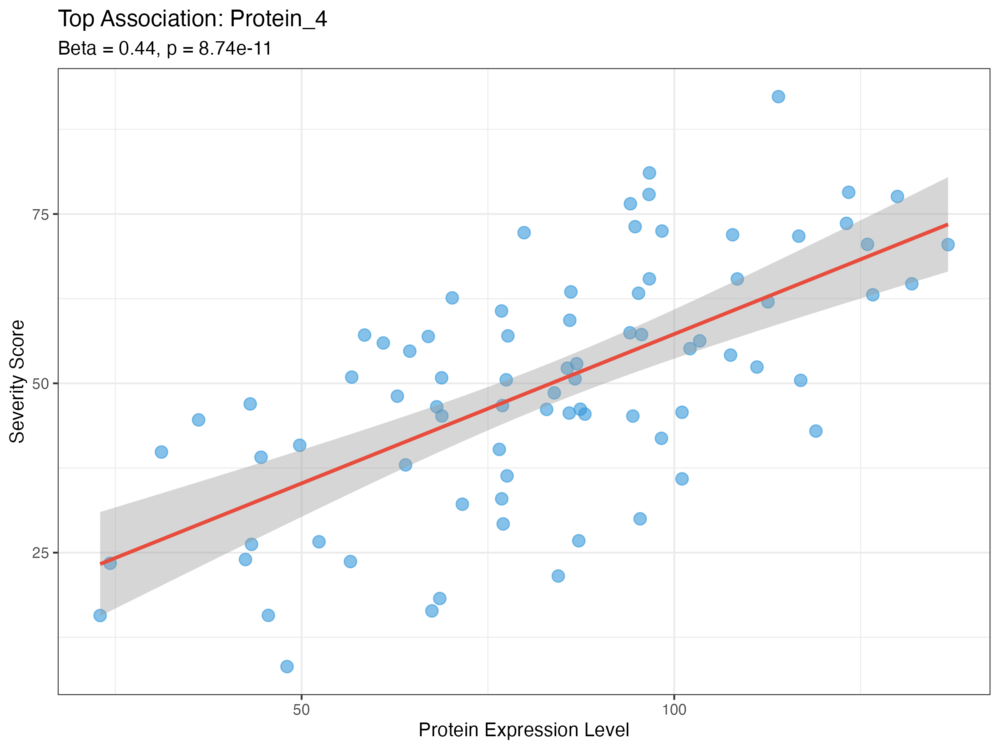
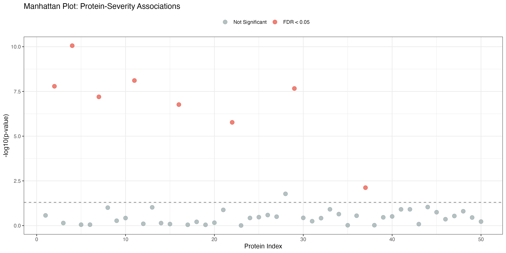

# Olink Data Analysis Examples

This directory contains example outputs from the Olink data analysis functions in the `mestools` package. These functions provide comprehensive tools for analyzing Olink protein expression data, including covariate adjustment and regression analyses.

## Table of Contents

1. [Covariate Adjustment](#covariate-adjustment)
2. [Regression Analysis - Binary Outcomes](#regression-analysis---binary-outcomes)
3. [Regression Analysis - Continuous Outcomes](#regression-analysis---continuous-outcomes)
4. [Example Data](#example-data)

---

## Covariate Adjustment

The `adjust_olink_covariates()` function removes confounding effects from protein expression data, such as batch effects, age, sex, and other technical or biological covariates.

### Batch Effect Removal

This visualization shows how the adjustment effectively removes batch-related variation while preserving biological signal.



**Key Findings:**
- Clear batch effects visible in original data (different distributions across batches)
- Adjusted data shows harmonized distributions across all batches
- Biological variability is preserved after adjustment

### Covariate Variance Explained

Distribution of R² values showing how much variance is explained by covariates (age, sex, batch) for each protein.



**Interpretation:**
- Median R² indicates the typical proportion of variance explained by covariates
- Higher R² values suggest proteins strongly influenced by technical/biological covariates
- Lower R² values indicate proteins with minimal confounding effects

### Usage Example

```r
library(mestools)

# Adjust for multiple covariates
result <- adjust_olink_covariates(
  count_matrix = your_protein_data,
  metadata = your_metadata,
  covariates = c("age", "sex", "batch"),
  sample_id_col = "sample_id",
  method = "adjusted"
)

# Access adjusted data
adjusted_data <- result$adjusted_matrix

# Check model performance
r_squared_values <- sapply(result$model_info, function(x) x$r_squared)
summary(r_squared_values)
```

---

## Regression Analysis - Binary Outcomes

The `olink_regression_analysis()` function performs univariate and multivariate association testing between protein expression and binary outcomes (e.g., disease status, case/control studies).

### Univariate Analysis

Forest plot showing odds ratios (OR) from univariate logistic regression for the top 20 proteins associated with disease status.



**Key Features:**
- Each protein analyzed independently against outcome
- Odds ratios with 95% confidence intervals
- P-values displayed for each association
- Red points indicate significant associations (p < 0.05)

### Multivariate Analysis

Forest plot showing odds ratios after adjusting for covariates (age, sex, BMI).



**Key Features:**
- Adjusted for confounding variables
- More conservative effect estimates
- Some associations may become stronger or weaker after adjustment
- Identifies independent associations

### Volcano Plot

Visualization of effect sizes (log OR) vs. statistical significance across all proteins.



**Interpretation:**
- X-axis: log(Odds Ratio) - distance from zero indicates effect magnitude
- Y-axis: -log10(p-value) - height indicates statistical significance
- Red points: FDR < 0.05 (significant after multiple testing correction)
- Points to the right: increased in cases; to the left: decreased in cases

### Univariate vs. Multivariate Comparison

Comparison of effect sizes before and after covariate adjustment.



**Interpretation:**
- Points on the diagonal: minimal change after adjustment
- Points above diagonal: effect strengthened after adjustment
- Points below diagonal: effect attenuated (confounding present)

### Usage Example - Binary Outcome

```r
library(mestools)

# Case-control study
results <- olink_regression_analysis(
  count_matrix = protein_expression_data,
  metadata = clinical_metadata,
  outcome = "disease_status",  # 0 = control, 1 = case
  outcome_type = "binary",
  covariates = c("age", "sex", "bmi"),
  sample_id_col = "sample_id",
  p_adjust_method = "BH"  # Benjamini-Hochberg FDR
)

# View top univariate results
head(results$univariate_results)

# View top multivariate results
head(results$multivariate_results)

# Filter significant proteins (FDR < 0.05)
significant_proteins <- results$univariate_results[
  results$univariate_results$p_adjusted < 0.05,
]

# Create forest plot
plot_forest_results(
  results = results,
  analysis_type = "multivariate",
  top_n = 20
)
```

---

## Regression Analysis - Continuous Outcomes

For continuous outcomes (e.g., disease severity scores, biomarker levels), the function performs linear regression and returns beta coefficients.

### Forest Plot - Beta Coefficients

Beta coefficients for the top 20 proteins associated with severity score.



**Interpretation:**
- Beta coefficient: change in outcome per unit change in protein expression
- Positive betas: higher protein → higher severity
- Negative betas: higher protein → lower severity
- 95% confidence intervals shown as error bars

### Top Protein Association

Scatter plot showing the relationship between the top-associated protein and the outcome.



**Features:**
- Each point represents one sample
- Linear regression line with 95% confidence interval
- Beta coefficient and p-value displayed in subtitle
- Clear visualization of the association strength

### Manhattan Plot

Overview of all protein associations across the entire dataset.



**Interpretation:**
- X-axis: protein index
- Y-axis: -log10(p-value) - taller peaks are more significant
- Horizontal line: significance threshold (p = 0.05)
- Red points: significant after FDR correction
- Useful for identifying clusters of associated proteins

### Usage Example - Continuous Outcome

```r
library(mestools)

# Severity score analysis
results <- olink_regression_analysis(
  count_matrix = protein_expression_data,
  metadata = clinical_metadata,
  outcome = "severity_score",  # Continuous variable
  outcome_type = "continuous",
  covariates = c("age", "sex"),
  sample_id_col = "sample_id",
  p_adjust_method = "BH"
)

# View top results
head(results$univariate_results)

# Identify proteins with largest effects
top_effects <- results$univariate_results[
  order(abs(results$univariate_results$beta), decreasing = TRUE),
][1:10, ]

# Create visualization
plot_forest_results(
  results = results,
  analysis_type = "univariate",
  top_n = 15,
  sort_by = "effect"
)
```

---

## Example Data

This directory includes sample CSV files with top results:

### Files

- **top10_univariate_binary.csv** - Top 10 proteins from univariate binary outcome analysis
- **top10_multivariate_binary.csv** - Top 10 proteins from multivariate binary outcome analysis
- **top10_univariate_continuous.csv** - Top 10 proteins from continuous outcome analysis

### Example Table Structure

**Binary Outcome Results:**

| protein | OR | OR_lower | OR_upper | log_OR | SE | p_value | p_adjusted | n_samples |
|---------|-----|----------|----------|--------|-----|---------|------------|-----------|
| Protein_5 | 3.45 | 2.01 | 5.92 | 1.238 | 0.274 | 7.74e-06 | 3.87e-04 | 80 |
| Protein_13 | 2.87 | 1.67 | 4.92 | 1.054 | 0.277 | 1.73e-04 | 4.32e-03 | 80 |

**Continuous Outcome Results:**

| protein | beta | beta_lower | beta_upper | SE | p_value | p_adjusted | n_samples |
|---------|------|------------|------------|-----|---------|------------|-----------|
| Protein_16 | 0.752 | 0.481 | 1.023 | 0.138 | 6.13e-08 | 3.07e-06 | 80 |
| Protein_7 | 0.691 | 0.426 | 0.956 | 0.135 | 3.47e-07 | 8.67e-06 | 80 |

---

## Key Functions Reference

### 1. `adjust_olink_covariates()`

Remove confounding effects from protein expression data.

**Parameters:**
- `count_matrix` - Protein × Sample matrix
- `metadata` - Sample metadata with covariates
- `covariates` - Vector of covariate names
- `method` - "residuals" or "adjusted"
- `log_transform` - Whether to log-transform data

**Returns:**
- `adjusted_matrix` - Covariate-adjusted expression data
- `model_info` - R², coefficients for each protein
- `covariates_used` - Covariates adjusted for
- `samples_used` - Samples included in analysis

### 2. `olink_regression_analysis()`

Perform univariate and multivariate association testing.

**Parameters:**
- `count_matrix` - Protein × Sample matrix
- `metadata` - Sample metadata
- `outcome` - Outcome variable name
- `outcome_type` - "binary" or "continuous"
- `covariates` - Covariates for multivariate adjustment
- `p_adjust_method` - Multiple testing correction method

**Returns:**
- `univariate_results` - Unadjusted associations
- `multivariate_results` - Covariate-adjusted associations
- `summary_stats` - Analysis summary
- `model_type` - "logistic" or "linear"

### 3. `plot_forest_results()`

Create forest plots of regression results.

**Parameters:**
- `results` - Results from `olink_regression_analysis()`
- `analysis_type` - "univariate" or "multivariate"
- `top_n` - Number of top proteins to display
- `show_pval` - Whether to show p-values

---

## Statistical Notes

### Multiple Testing Correction

All analyses apply multiple testing correction to account for testing many proteins simultaneously. The default method is Benjamini-Hochberg FDR control.

**Available methods:**
- `"BH"` or `"fdr"` - Benjamini-Hochberg (recommended for discovery)
- `"bonferroni"` - Bonferroni (most conservative)
- `"holm"` - Holm step-down
- `"none"` - No correction (not recommended)

### Model Selection

**Binary outcomes:** Logistic regression
- Returns odds ratios (OR)
- OR > 1: positive association
- OR < 1: negative association
- OR = 1: no association

**Continuous outcomes:** Linear regression
- Returns beta coefficients
- Beta > 0: positive association
- Beta < 0: negative association
- Beta = 0: no association

### Covariate Adjustment

Two methods available:

1. **Residuals method** - Returns residuals from linear model
   - Removes mean from adjusted values
   - Best for downstream association testing

2. **Adjusted method** - Returns adjusted values with mean preserved
   - Original scale maintained
   - Better for visualization and interpretation

---

## Reproducibility

All examples were generated using:

```r
source("generate_olink_examples.R")
```

Random seeds are set within the script for reproducibility:
- Covariate adjustment: `seed = 12345`
- Binary outcome analysis: `seed = 54321`
- Continuous outcome analysis: `seed = 99999`

---

## Citation

If you use these functions in your research, please cite:

```
mestools: Microbiome and Epidemiology Statistical Tools
https://github.com/vanhungtran/mestools
```

---

## Additional Resources

- **Package Documentation:** Run `?adjust_olink_covariates` or `?olink_regression_analysis` in R
- **Test Files:** See `tests/testthat/test-olink-*.R` for comprehensive examples
- **Source Code:** `R/olink-covariate-adjustment.R` and `R/olink-regression-analysis.R`

---

*Generated: 2026-01-14*
*Package: mestools*
*R Version: 4.5+*
